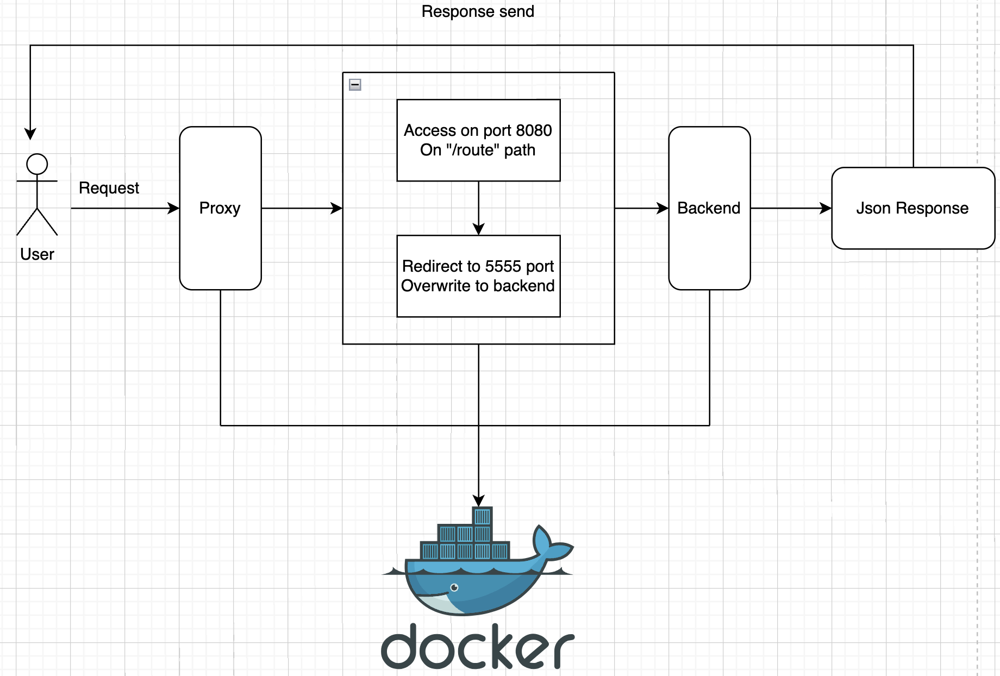

## Mockup Api with Fastapi framework

### **Feature of api**
- List all user.
- Add new user.
- Delete user.
- Update user.
- View user detail.
- Search/Filter user.
- Custom response with **400X** error.

### Available Features
- [x] Build with **Docker**/**Docker Compose**.
- [x] Entity transfer **DTO**.
- [x] Proxy config.
- [ ] Deploy to pipeline production config.
- [ ] Deploy to pipeline staging config.

### **Installation**
**Config with Anaconda** (By pass if use python 3.10/3.11 native in local computer)
```bash
conda create --name mockup-api python=3.11
```

**Install requirements**
```bash
pip install -r requirements.txt
```

### **Run server**
- **Dev environment**
```bash
python main.py --host=127.0.0.1 --port=9999 --reload=True --workers=4 --log_level=info --limit_max_request=1000 --limit_concurrency=1000 --backlog=5000
```

- **Production environment**
```bash
python main.py --host=0.0.0.0 --port=5555 --reload=False --workers=4 --log_level=info --limit_max_request=10000 --limit_concurrency=10000 --backlog=5000 --ssl_keyfile=/etc/nginx/ssl/private.pem --ssl_certfile=/etc/nginx/ssl/cert.pem
```

## Architecture
